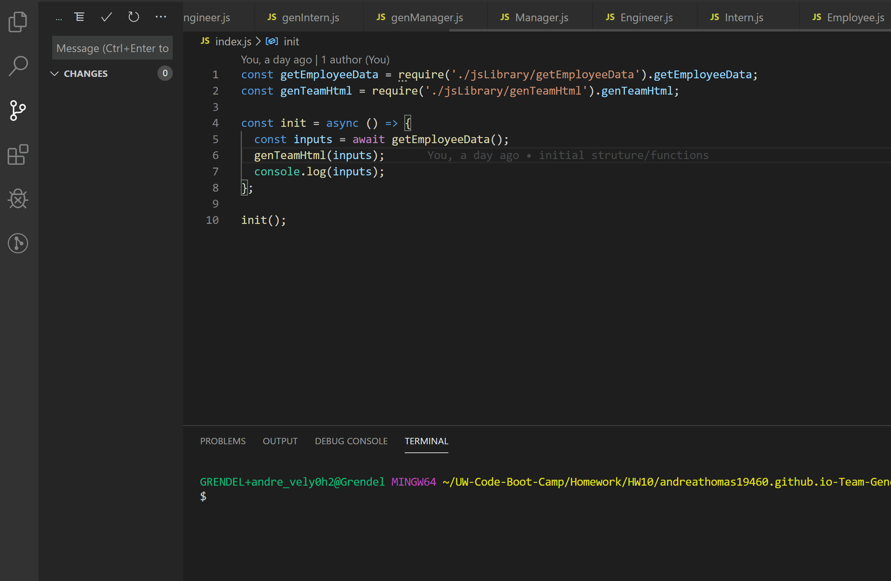

# andreathomas19460.github.io-Team-Generator

# Developer Profile Generator

## Description

The command-line application generates profiles of employees related to a team.

## User Story

```
As a manager

I want to generate a webpage that displays my team's basic info

so that I have quick access to emails and GitHub profiles

```
## Functionality GIF



## How It Works

* User runs 'npm i' for dependencies in the terminal [inquirer, fs] [if error, try npm install inquirer]
* Initiates from the command 'node index.js' in the terminal
* User is prompted with questions of the team member
* User is prompted for additional employee inputs
* With inputs, app generates html file [fs] 

## Link

 https://andreathomas19460.github.io/andreathomas19460.github.io-Team-Generator/

## Status 

Functional! Missing tests

## Author

Andrea Thomas
